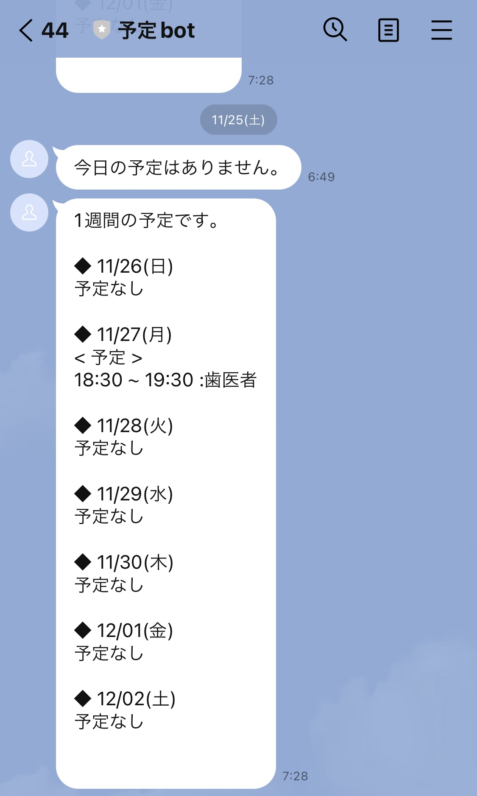
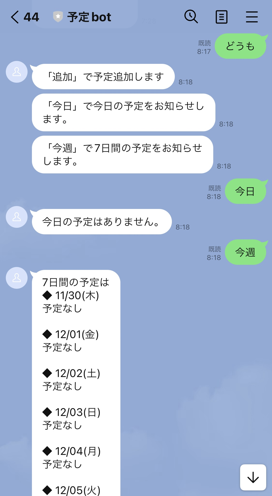

# apps
## 概要
各アプリの概要を以下に記載する。

1. [カレンダーのLINE連携](https://github.com/katayama-pol/tools/tree/develop#1-カレンダーのLINE連携)

 

### 1. カレンダーのLINE連携
* googleカレンダーとLINEを連携し、googleカレンダーに登録されている予定を通知するbot。  
GASでデプロイしてトリガー設定をすることで、毎日当日の予定と向こう一週間の予定をLINEで自動通知してくれる。
  

 

* LINEで直接予定を追加したり、任意のタイミングで予定を取得することもできる。
  

 

#### 外部カレンダーとの同期
* 外部カレンダーとgoogleカレンダーを同期することで、外部カレンダーの予定をLINE通知させることができる。  
ここではTimeTree APIを使用している。  
**※なお、TimeTree APIは2023/12/22でサービス終了する事が告知されていますが、リポジトリのコードは参考として残します。**